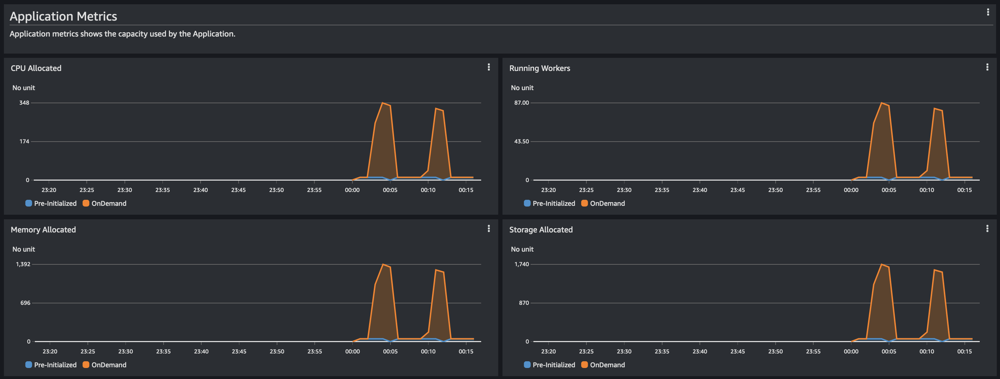
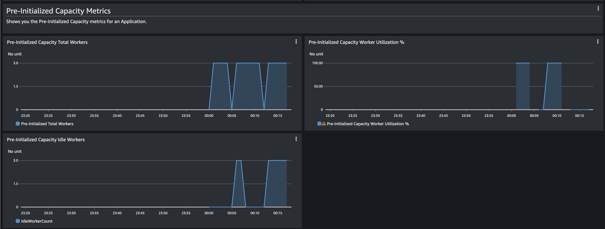
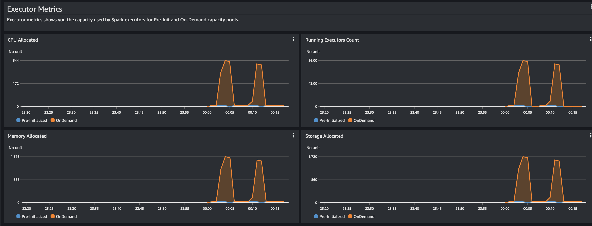
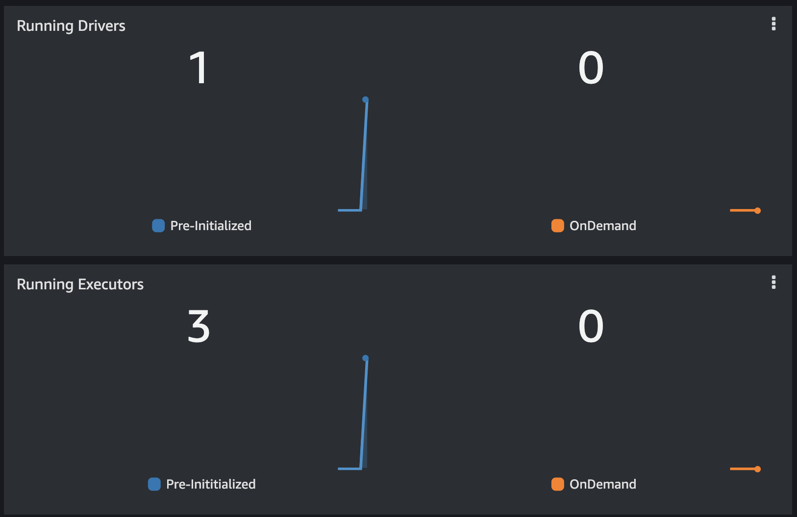
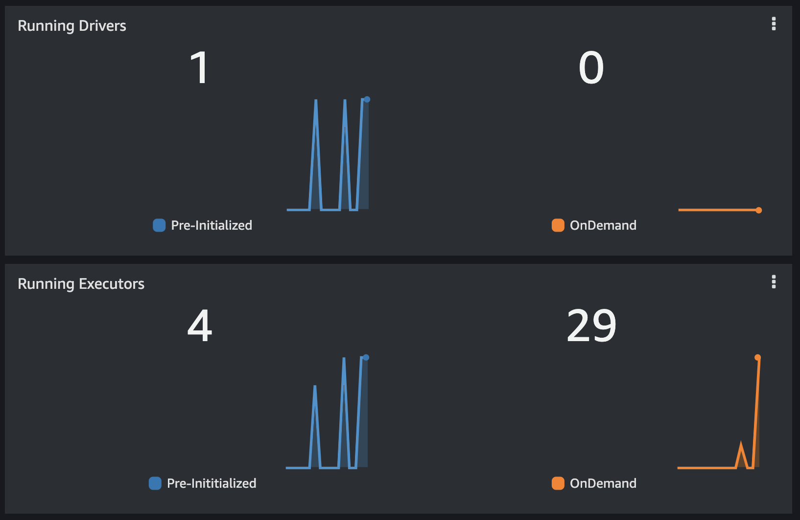

# EMR Serverless CloudWatch Dashboard

You can visualize EMR Serverless application and job metrics in a CloudWatch Dashboard. The CloudFormation template provided in this repo can be used to deploy the sample CloudWatch Dashboard for Spark applications on EMR Serverless.

## Overview

The CloudWatch Dashboard provides an overview of pre-initialized capacity vs. OnDemand as well as drill-down metrics for CPU, memory, and disk usage for Spark Drivers and Executors. [Pre-initialized capacity is an optional feature of EMR Serverless](https://docs.aws.amazon.com/emr/latest/EMR-Serverless-UserGuide/application-capacity.html) that keeps driver and workers pre-initialized and ready to respond in seconds and this dashboard can help understand if pre-initialized capacity is being used effectively.

In addition, you can see job-level metrics for the state of your jobs on a per-application basis.

Follow along below to see how to get started or see a full demo in the [walkthrough](#example-walkthrough) section.

## Getting started

**From the CloudFormation Console:**

1. Open the AWS CloudFormation console at https://console.aws.amazon.com/cloudformation.
2. Create a new stack by choosing: `Create Stack`
3. Choose the option `Upload a template file` and upload the `emr_serverless_cloudwatch_dashboard.yaml` template
4. In the next page, add a Stack name for the stack.
5. In the Parameters section, put in the `Application ID` of the EMR Serverless application you want to monitor
6. Choose `Create Stack` in the final page.

**From the CLI:**

Alternatively, you can also deploy this dashboard using the CLI:

```
aws cloudformation create-stack --region <region> \
    --stack-name emr-serverless-dashboard \
    --template-body <file:///path/emr_serverless_cloudwatch_dashboard.yaml> \
    --parameters ParameterKey=ApplicationID,ParameterValue=<Application Id>
```

Once the stack is created, you'll have a new CloudWatch Dashboard with the name `emr-serverless-dashboard-<APPLICATION_ID>` under Dashboards in the CloudWatch console at https://console.aws.amazon.com/cloudwatch/. 

------------------

## Dashboard Details

The sample Cloudwatch Dashboard provides the following functionality:

- Capacity Utilization Snapshot view - Shows current Pre-Initialized vs. OnDemand usage
  -  Point in time view of Pre-Initialized Capacity Worker Utilization %
  -  Point in time view of Available Workers (Drivers + Executors)
  -  Point in time view of Running Drivers
  -  Point in time view of Running Executors
 
 

- Job Runs - Aggregate view of job states for your application per minute
    - Point in time counters for different states including Pending, Running, and Failed jobs.


- Application Metrics - Shows capacity used by your application
  - Timeline view of Running Workers
  - Timeline view of CPU Allocated 
  - Timeline view of Memory Allocated 
  - Timeline view of Disk Allocated 

 

- Pre-Initialized Capacity Metrics - Shows how utilized the pre-initialized capacity is
  - Timeline view of Total Workers
  - Timeline view of idle Workers
  - Timeline view of Pre-Initialized Capacity Worker Utilization % (Workers used / Total Workers)

 

- Driver Metrics
  - Timeline view of Running Drivers
  - Timeline view of CPU Allocated 
  - Timeline view of Memory Allocated 
  - Timeline view of Disk Allocated 

 

- Executors Metrics
  - Timeline view of Running Executors
  - Timeline view of CPU Allocated 
  - Timeline view of Memory Allocated 
  - Timeline view of Disk Allocated 

 

- Job Metrics
    - Timeline view of Running Jobs
    - Timeline view of Success Jobs
    - Timeline view of Failed Jobs
    - Timeline view of Cancelled Jobs


## Example Walkthrough

Let's take a quick look and see how we can use the dashboard to optimize our EMR Serverless applications.

In this example, we'll start an application with a limited set of pre-initialized capacity and run jobs that both fit and exceed that capacity and see what happens.

> [!NOTE]
> EMR Serverless sends metrics to Amazon CloudWatch every 1 minute, so you may see different behavior depending on how quickly you run the commands.

### Pre-requisites

To walk through this demo, you'll need the following:

- Access to EMR Serverless and the ability to create new CloudFormation Stacks
- A job runtime role (for instructions see https://docs.aws.amazon.com/emr/latest/EMR-Serverless-UserGuide/getting-started.html#gs-prerequisites)

### Walkthrough

1. Create and start an EMR Serverless application with an initial capacity of 1 driver and 4 executors. 

```bash
aws emr-serverless create-application \
    --name cloudwatch-dashboard-demo \
    --type SPARK \
    --release-label emr-6.7.0 \
    --initial-capacity '{
        "DRIVER": {
            "workerCount": 1,
            "workerConfiguration": {
                "cpu": "2vCPU",
                "memory": "4GB"
            }
        },
        "EXECUTOR": {
            "workerCount": 4,
            "workerConfiguration": {
                "cpu": "4vCPU",
                "memory": "8GB"
            }
        }
    }'
```

You'll get back information about the created application - set your `APPLICATION_ID` environment variable appropriately.

```json
{
    "applicationId": "00fabcdef12525",
    "name": "cloudwatch-dashboard-demo",
    "arn": "arn:aws:emr-serverless:us-east-1:123456789012:/applications/00fabcdef12525"
}
```

```bash
APPLICATION_ID=00fabcdef12525
aws emr-serverless start-application --application-id $APPLICATION_ID
```

Wait for the application to start and continue with the next step.

```bash
aws emr-serverless get-application --application-id $APPLICATION_ID
```

```json
{
    "application": {
        "applicationId": "00fabcdef12525",
        "name": "cloudwatch-dashboard-demo",
        "arn": "arn:aws:emr-serverless:us-east-1:123456789012:/applications/00fabcdef12525",
        "releaseLabel": "emr-6.7.0",
        "type": "Spark",
        "state": "STARTED",
        ...
    }
}
```

2. Create a CloudWatch Dashboard

Using the `APPLICATION_ID` variable above, create the corresponding dashboard.

```bash
aws cloudformation create-stack \
    --stack-name emr-serverless-dashboard \
    --template-body file://emr_serverless_cloudwatch_dashboard.yaml \
    --parameters ParameterKey=ApplicationID,ParameterValue=$APPLICATION_ID
```

Go ahead and open your new dashboard:

```bash
open https://console.aws.amazon.com/cloudwatch/home#dashboards:name=emr-serverless-dashboard-$APPLICATION_ID
```

You should notice your application is currently showing 0% "Pre-Initialized Capacity Worker Utilization" and you have 5 Pre-Initialized workers in the "Available Workers" section. That's the combined value of your drivers and executors.


3. Run a simple job

Let's go ahead and run a job that will consume a limited amount of resources. We'll use the [Pi example](https://github.com/apache/spark/blob/master/examples/src/main/python/pi.py) built in to Spark.

Because we configured our pre-initialized capacity a little bit lower than the [Spark defaults](https://docs.aws.amazon.com/emr/latest/EMR-Serverless-UserGuide/jobs-spark.html#spark-defaults), we need to explicitly specify driver and executor settings when we submit the job.

```bash
# Set your job runtime role as a variable
JOB_ROLE_ARN=arn:aws:iam::123456789012:role/EMRServerlessS3RuntimeRole

aws emr-serverless start-job-run \
    --name pi-default \
    --application-id $APPLICATION_ID \
    --execution-role-arn $JOB_ROLE_ARN \
    --job-driver '{
        "sparkSubmit": {
            "entryPoint": "local:///usr/lib/spark/examples/src/main/python/pi.py",
            "sparkSubmitParameters": "--conf spark.driver.cores=2 --conf spark.driver.memory=3g --conf spark.executor.memory=7g"
        }
    }'
```

If we look at the "Running Drivers" and "Running Executors" charts, we'll see that 1 Pre-Initialized Driver and 3 Pre-Initilized Executors are being used, while there are 0 OnDemand workers. 



Let's see what happens when we use more executors than the pre-initialized capacity.

4. Run a job with more executors

We'll simply tell EMR Serverless to use more executor instances (the default is 3) and bump up the number of tasks in the `pi.py` job so the executors actually get used.

```bash
aws emr-serverless start-job-run \
    --name pi-more-executors \
    --application-id $APPLICATION_ID \
    --execution-role-arn $JOB_ROLE_ARN \
    --job-driver '{
        "sparkSubmit": {
            "entryPoint": "local:///usr/lib/spark/examples/src/main/python/pi.py",
            "entryPointArguments": ["2000"],
            "sparkSubmitParameters": "--conf spark.driver.cores=2 --conf spark.driver.memory=3g --conf spark.executor.memory=7g --conf spark.executor.instances=10"
        }
    }'
```

Now if we look at the "Running Executors" chart, we'll see that we're using additional OnDemand capacity because we have more executors than the "4" configured for pre-initialized capacity.



Note that the job started immediately because we had enough capacity for the driver and it added more executors after the job started.

5. Run a job with more drivers

If we submit two jobs at once, we'll see that the first job can make use of pre-initialized capacity while the second job will request OnDemand capacity.

```bash
aws emr-serverless start-job-run \
    --name pi-more-drivers-1 \
    --application-id $APPLICATION_ID \
    --execution-role-arn $JOB_ROLE_ARN \
    --job-driver '{
        "sparkSubmit": {
            "entryPoint": "local:///usr/lib/spark/examples/src/main/python/pi.py",
            "entryPointArguments": ["10000"],
            "sparkSubmitParameters": "--conf spark.driver.cores=2 --conf spark.driver.memory=3g --conf spark.executor.memory=7g"
        }
    }'

aws emr-serverless start-job-run \
    --name pi-more-drivers-2 \
    --application-id $APPLICATION_ID \
    --execution-role-arn $JOB_ROLE_ARN \
    --job-driver '{
        "sparkSubmit": {
            "entryPoint": "local:///usr/lib/spark/examples/src/main/python/pi.py",
            "entryPointArguments": ["10000"],
            "sparkSubmitParameters": "--conf spark.driver.cores=2 --conf spark.driver.memory=3g --conf spark.executor.memory=7g"
        }
    }'
```

In the EMR Studio console, we see the first job starts running immediately and the second is "Scheduled" pending an OnDemand Driver.


In the "Running Drivers" chart, we'll see 1 Pre-Initialized driver and 1 OnDemand driver as EMR Serverless responds to the request for more resources. 


Feel free to try other configurations and see how the dashboard responds. When you're done, make sure to delete your EMR Serverless application if you no longer need it.

```bash
aws emr-serverless stop-application --application-id $APPLICATION_ID
aws emr-serverless delete-application --application-id $APPLICATION_ID
```